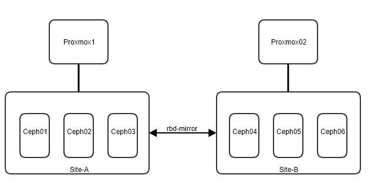
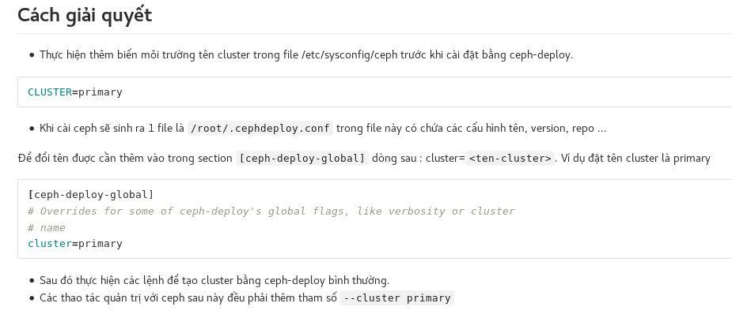
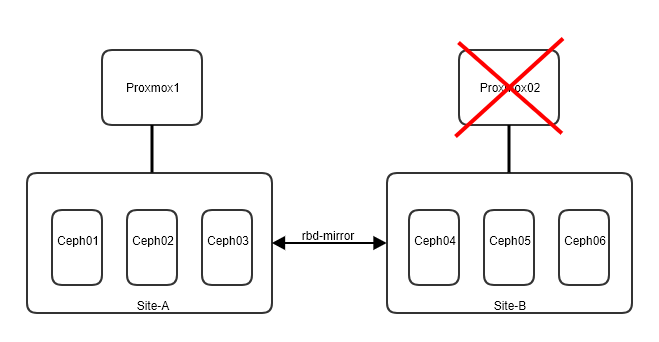
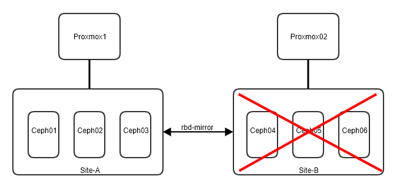

# RBD Mirror 

Có 2 mode chính có thể sử dụng 

- pool: Cấu hình mirror trên pool, các images nào có enable feature `journaling` sẽ tự động mirror

- image: Chỉ định images mirror (Vẫn y/c enable feature `journaling`)

# Menu 
- RBD One-way mirror
- RBD Two-way mirror
- Khôi phục sau thảm họa 
- Các tham số cấu hình của rbd-mirror

# RBD One-way mirror

- Một cách đồng bộ không realtime từ Cluster chính sang cluster phụ 
- Có thể có nhiều cụm phụ 
- Đối với việc cấu hình mirror theo pool, toàn bộ images có feature `journaling` sẽ được mirror

## Mục tiêu bài lab 
Giả định rằng có hai cụm, một cụm được gọi là Ceph chứa images được sử dụng trong prod và cụm Cephbackup tại đó images được kéo về từ cluster sao lưu để khôi phục sau thảm họa. 
Ý tưởng chung là một hoặc nhiều rbd-mirror trên cụm cephbackup sẽ kéo backup các images từ cụm Ceph 

Nếu sử dụng đồng bộ 2 chiều cần cấu hình ngược lại 

## Các bước thực hiện 
- Cấu hình pool enable mirror 
- Tạo images và add thêm feature để có thể mirror
- Cài đặt rbd-mirror trên node client Cluster 
- Cấu hình cả 2 cluster bằng cách add user connect vào cluster 
- Cấu hình mirror từ Cluster chính bằng cách thiết lập kết nối qua key 
- Start rbd-mirror 

## Các yêu cầu cơ bản 
- Mindset cơ bản 


- Chuẩn bị 2 cụm có 2 cluster name khác nhau 
    + Cluster Site-A 10.0.12.51,52,53 --cluster=site-a
    + Cluster Site-B 10.0.12.66,67,68 --cluster=site-b 



- Network giữa 2 cụm phải đảm bảo bandwidth cho việc kết nối đồng bộ rbd-mirror

- Ceph-deploy deploy với cluster name khác 


- Hoặc có thể dùng [ceph-ansible](../setup/ceph-ansible-nautilus.md) để triển khai với `all.yml` bổ sung thêm `cluster: site-a`

## Chuẩn bị trên cả 2 cụm 

Tạo pool
```sh 
ceph osd pool create rbd 256
ceph osd pool set rbd size 2
ceph osd pool application enable rbd rbd 
```

Enable mirror mode 
```sh 
rbd mirror pool enable rbd pool
```

Tạo alias để thao tác trên cụm Ceph
```sh 
echo """
alias ceph='ceph --cluster site-a'
alias rbd='rbd --cluster site-a'
""" >> /root/.bashrc
source /root/.bashrc
```

Tạo alias để thao tác trên cụm Cephbackup
```sh 
echo """
alias ceph='ceph --cluster site-b'
alias rbd='rbd --cluster site-b'
""" >> /root/.bashrc
source /root/.bashrc
```

## Tạo images để test mirror trên cụm Ceph

Tạo images 
```sh 
rbd create rbd/images --size 4G
```

Enable feature 
```sh 
rbd feature enable rbd/images journaling
```

Kiểm tra feature 
```sh 
rbd info rbd/images
```

## Tạo user trên cụm Ceph
```sh 
ceph auth get-or-create client.site-a mon 'profile rbd' osd 'profile rbd pool=rbd' -o /etc/ceph/site-a.client.site-a.keyring
```

## Tạo user trên cụm CephBackup 
```sh
ceph auth get-or-create client.site-b mon 'profile rbd' osd 'profile rbd pool=rbd' -o /etc/ceph/site-b.client.site-b.keyring
```

## Copy config và key của cụm Ceph sang node cụm CephBackup 
> Yêu cầu node 

```sh 
scp /etc/ceph/site-a.conf root@10.0.10.66:/etc/ceph/
scp /etc/ceph/site-a.client.site-a.keyring root@10.0.10.66:/etc/ceph/
```

## Start rbd-mirror daemon trên node cụm CephBackup 
Cài đặt `rbd-mirror`
```sh
yum install rbd-mirror -y 
```

Enable service rbd-mirror
```sh
systemctl enable ceph-rbd-mirror.target
systemctl enable ceph-rbd-mirror@site-b
systemctl start ceph-rbd-mirror@site-b
```

## Add peer trên node cụm Ceph Backup 
```sh
rbd --cluster site-b mirror pool peer add rbd client.site-a@site-a -n client.site-b
```

## Kiểm tra 

```sh 
rbd mirror pool info rbd
rbd mirror pool status rbd --verbose
```

## Kết quả 
```sh 
[root@ceph04 ~]# rbd mirror pool status rbd --verbose
health: OK
images: 1 total
    1 replaying

images:
  global_id:   a1d4c423-6f86-45bc-82e4-c080a94d0397
  state:       up+replaying
  description: replaying, master_position=[object_number=3, tag_tid=1, entry_tid=3], mirror_position=[object_number=3, tag_tid=1, entry_tid=3], entries_behind_master=0
  service:     site-b on ceph04
  last_update: 2020-07-17 09:56:11
[root@ceph04 ~]# 
```

# RBD Two-way mirror

Thực hiện Mirror 1 chiều ở phía trên và thực hiện theo hướng ngược lại 

## Copy config và key của cụm CephBackup sang node cụm Ceph
> Yêu cầu node 

```sh 
scp /etc/ceph/site-b.conf root@10.0.10.66:/etc/ceph/
scp /etc/ceph/site-b.client.site-a.keyring root@10.0.10.55:/etc/ceph/
```

## Start rbd-mirror daemon trên node cụm Ceph
Cài đặt `rbd-mirror`
```sh
yum install rbd-mirror -y 
```

Enable service rbd-mirror
```sh
systemctl enable ceph-rbd-mirror.target
systemctl enable ceph-rbd-mirror@site-a
systemctl start ceph-rbd-mirror@site-a
```

## Add peer trên node cụm Ceph 
```sh
rbd --cluster site-a mirror pool peer add rbd client.site-b@site-b -n client.site-a
```

## Kiểm tra 

```sh 
rbd mirror pool info rbd
rbd mirror pool status rbd --verbose
```

## Kết quả 
```sh 
[root@ceph04 ~]# rbd mirror pool status rbd --verbose
health: OK
images: 1 total
    1 replaying

images:
  global_id:   a1d4c423-6f86-45bc-82e4-c080a94d0397
  state:       up+replaying
  description: replaying, master_position=[object_number=3, tag_tid=1, entry_tid=3], mirror_position=[object_number=3, tag_tid=1, entry_tid=3], entries_behind_master=0
  service:     site-b on ceph04
  last_update: 2020-07-17 09:56:11
[root@ceph04 ~]# 
```

```sh 
[root@ceph01 ~]# rbd mirror pool info rbd
Mode: pool
Site Name: 297e5fc2-df2c-4d48-af8d-bed39b04ca69
Peers: 
  UUID                                 NAME   CLIENT        
  5a53bbd8-3363-47b3-bb3e-ccfeda5d8048 site-b client.site-b 
[root@ceph01 ~]# rbd mirror pool status rbd --verbose
health: OK
images: 1 total
    1 stopped

images:
  global_id:   a1d4c423-6f86-45bc-82e4-c080a94d0397
  state:       up+stopped
  description: local image is primary
  service:     site-a on ceph01
  last_update: 2020-07-17 10:21:16
[root@ceph01 ~]# 
```


## Tạo images để test mirror trên cụm CephBackup

Tạo images 
```sh 
[root@ceph04 ~]#  rbd create rbd/images2 --size 4G
```

Enable feature 
```sh 
rbd feature enable rbd/images2 journaling
```

Kiểm tra feature 
```sh 
rbd info rbd/images2
```

Kiểm tra trên cụm Ceph 
```sh 
[root@ceph01 ~]# rbd mirror pool status rbd --verbose
health: OK
images: 2 total
    1 replaying
    1 stopped

images:
  global_id:   a1d4c423-6f86-45bc-82e4-c080a94d0397
  state:       up+stopped
  description: local image is primary
  service:     site-a on ceph01
  last_update: 2020-07-17 10:23:14

images2:
  global_id:   31a175d2-0179-4949-9e69-2b248c8245a7
  state:       up+replaying
  description: replaying, master_position=[object_number=3, tag_tid=1, entry_tid=3], mirror_position=[], entries_behind_master=3
  service:     site-a on ceph01
  last_update: 2020-07-17 10:23:09
[root@ceph01 ~]#

[root@ceph04 ~]#  rbd mirror pool status rbd --verbose
health: OK
images: 2 total
    1 replaying
    1 stopped

images:
  global_id:   a1d4c423-6f86-45bc-82e4-c080a94d0397
  state:       up+replaying
  description: replaying, master_position=[object_number=3, tag_tid=1, entry_tid=3], mirror_position=[object_number=3, tag_tid=1, entry_tid=3], entries_behind_master=0
  service:     site-b on ceph04
  last_update: 2020-07-17 10:24:31

images2:
  global_id:   31a175d2-0179-4949-9e69-2b248c8245a7
  state:       up+stopped
  description: local image is primary
  service:     site-b on ceph04
  last_update: 2020-07-17 10:24:05
[root@ceph04 ~]# 
```

# Khôi phục sau thảm họa 

## Cụm Hypervisor SiteB gặp vấn đề 


Failed-over
- Depromote các images của cụm SiteB trên Storage SiteB (Chuyển Primary thành Secondary trên cụm cũ B)
- Promote các images của cụm SiteB trên Storage SiteA (Chuyển Secondary thành Primary trên cụm mới A)
- Copy xml các VM cụm SiteB từ node backup config qua Hyperviser Proxmox01 của cụm SiteA
- Start VM của cụm cũ SiteB trên SiteA

Failed-back
- Promote các images của cụm SiteB trên Storage SiteB (Chuyển Secondary thành Primary trên cụm SiteB sau khi khôi phục)
- Depromote các images của cụm SiteB trên Storage SiteA (Chuyển Primary thành Secondary trên cụm SiteA)
- Xóa XML cũ trên cụm SiteA (Không thực hiện xóa VM)
- Start VM lại trên cụm SiteB

## Cụm Storage SiteB gặp vấn đề 


Failed-over
- `--force` Promote các images của cụm SiteB trên Storage SiteA (Chuyển Secondary thành Primary trên cụm mới A)
- Copy xml các VM cụm SiteB từ node backup config qua Hyperviser Proxmox01 của cụm SiteA
- Start VM của cụm cũ SiteB trên SiteA

Failed-back
- Depromote các images của cụm SiteB trên Storage SiteB (Chuyển Primary thành Secondary trên cụm SiteB sau khi khôi phục nhằm đồng bộ ngược dữ liệu về)
- Depromote các images của cụm SiteB trên Storage SiteA (Chuyển Primary thành Secondary trên cụm SiteA để đồng bộ dữ liệu ngược lại)
- Promote các images của cụm SiteB trên Storage SiteB (Chuyển Secondary thành Primary trên cụm SiteB sau khi đồng bộ dữ liệu xong)
- Xóa XML cũ trên cụm SiteA (Không thực hiện xóa VM)
- Start VM lại trên cụm SiteB

## Các câu lệnh hay thao tác cơ bản 
```sh 
# Check status 
rbd mirror pool info {pool} 
rbd mirror pool status {pool} 
rbd mirror pool status {pool} --verbose
rbd mirror image status {pool}/{image}

# Demote image 
rbd mirror image demote {pool}/{image}

# Promote 
rbd mirror image promote {pool}/{image}

# Force promote (Storage DR)
rbd mirror image promote --force {pool}/{image}
```


# Cấu hình tự động enable journaling 
```sh 
rbd_default_features = 125
```

# Các tham số cấu hình của rbd-mirror
```sh 
[root@ceph01 ~]# ceph-conf --show-config | grep mirror
did not load config file, using default settings.
bluestore_bluefs_env_mirror = false
debug_rbd_mirror = 0/5
rbd_mirror_concurrent_image_deletions = 1 
rbd_mirror_concurrent_image_syncs = 5
rbd_mirror_delete_retry_interval = 30.000000
rbd_mirror_image_policy_migration_throttle = 300
rbd_mirror_image_policy_rebalance_timeout = 0.000000
rbd_mirror_image_policy_type = simple
rbd_mirror_image_policy_update_throttle_interval = 1.000000
rbd_mirror_image_state_check_interval = 30
rbd_mirror_journal_commit_age = 5.000000
rbd_mirror_journal_max_fetch_bytes = 32768
rbd_mirror_journal_poll_age = 5.000000
rbd_mirror_leader_heartbeat_interval = 5
rbd_mirror_leader_max_acquire_attempts_before_break = 3
rbd_mirror_leader_max_missed_heartbeats = 2
rbd_mirror_perf_stats_prio = 5
rbd_mirror_pool_replayers_refresh_interval = 30
rbd_mirror_sync_point_update_age = 30.000000
rbd_mirroring_delete_delay = 0
rbd_mirroring_replay_delay = 0
rbd_mirroring_resync_after_disconnect = false
[root@ceph01 ~]#
```

# Tài liệu tham khảo 
- https://access.redhat.com/documentation/en-us/red_hat_ceph_storage/4/html-single/block_device_guide/index#mirroring-ceph-block-devices